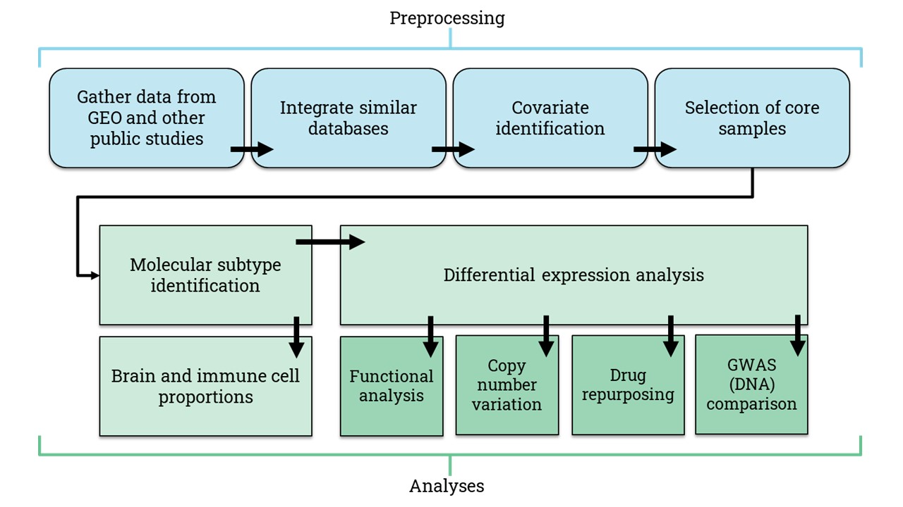

## Abstract

The thesis detailed here intends to fulfill the requirements for the Master’s in Computer Science. Neurodegenerative human diseases are a significant problem due to their high prevalence. It is estimated that 1 to 2% of people over the age of 60 years has Parkinson’s disease. The population with Alzheimer disease is approximately 24 million, and it is expected to double. In the US, 30,000 people are estimated to have Huntington Disease (HD). These diseases have no cure, they are fatal, and the quality of life of the patient is appalling. In this study, a comprehensive pipeline comprised of a preprocessing phase and an analytic phase of seven analyses was developed. The main objective was to interrogate public RNA-seq expression data in order to better understand the pathophysiology of the mentioned neurodegenerative diseases (NDs). The analytic phase includes identification of molecular subtypes of the disease, brain and immune cell types proportion estimation, differential gene expression analysis, bypass of copy number variation evaluation, functional analysis, drug repurposing, and comparison of the obtained results with those contained in genome-wise association studies. The interrogation provided key pathways of each disease, and routes that are shared among the NDs. Moreover, pivotal genes resulted in the comparison between diseases and tissues, and were paired with annotated and unannotated genome variants; for HD a possible blood biomarker was suggested. Finally, more than 30 known drugs were repurposed as a plausible treatment to these NDs.

The complete manuscript can be found [here](https://repositorio.tec.mx/handle/11285/640821).

## Pipeline

The process followed to achieve the final results are summarized in the next diagram.

## Contents

This repository is organized in the same way as the pipeline. Each module is located in different folders, starting from data gathering to drug repurposing. Note that the final module "GWAS comparison" is not included since it was done using online services. The function *limma4DS_fdr.R* is utilized several times along the modules, and it performs the differential gene expression analysis between two groups (normally, control vs case). Moreover, the manuscript in Latex code is also shared in the folder *Thesis Latex code*.

## Requirements

In order to run the complete pipeline, the following libraries are required:
* limma
* BiocManager
* GEOQuery
* sva
* preprocessCore
* RColorBrewer
* biomaRt
* dplyr
* gplots
* pheatmap
* MSigDBr
* clusterProfiler
* clusterProfiler.dplyr
* enrichplot
* stringr
* randomcoloR
* PharmacoGx

## Cite

If you use this code or mention the pipeline presented here, please cite:

Marini Macouzet, Constanza.(2021). Pathway Identification and Drug Repurposing for Neurodegenerative Diseases: A Public RNA-seq Data Strategy. Instituto Tecnológico y de Estudios Superiores de Monterrey. Retrieved from https://hdl.handle.net/11285/640821
